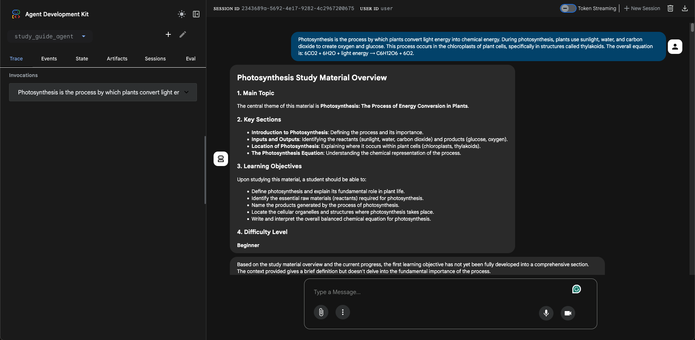
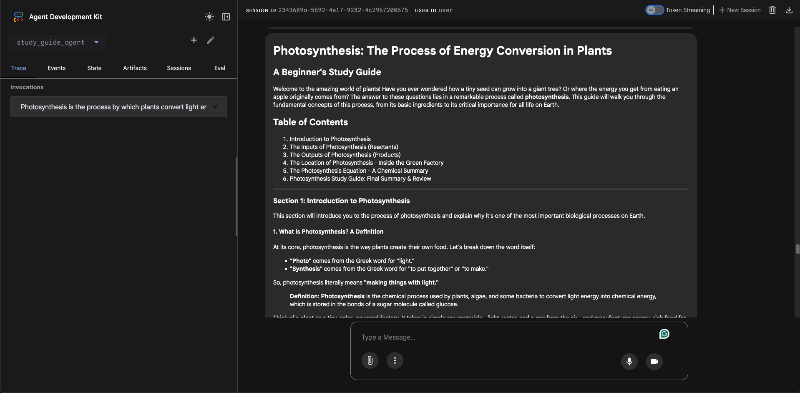
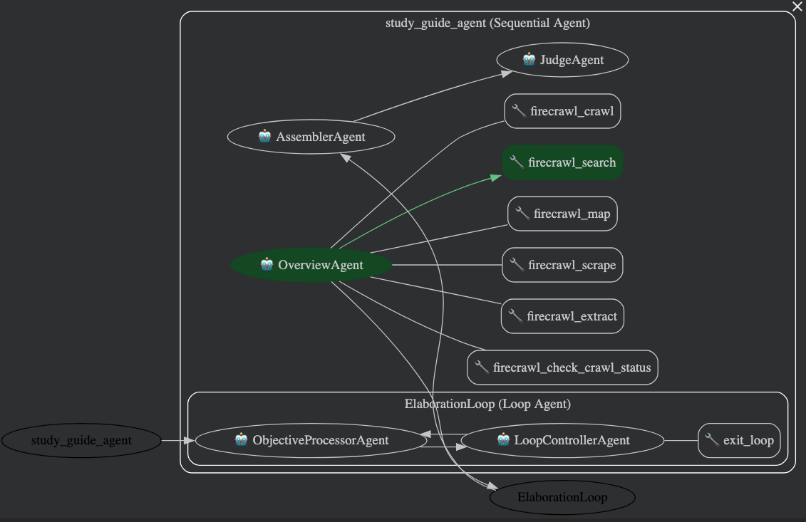

# Study Guide Agent - AI Agents Intensive Capstone Project

Multi-agent educational content generation system using Google ADK (Agent Development Kit).

## Problem Statement

Students and educators need high-quality study materials tailored to specific topics, but creating comprehensive study guides is time-consuming and requires pedagogical expertise. This agent automates the creation of educational content with built-in quality control, generating structured study guides that adapt to any subject matter.

## Overview

This project implements an intelligent multi-agent system for automated study guide generation. Using Google's Agent Development Kit (ADK), the system orchestrates four specialized agents in a sequential pipeline with iterative loop processing. The architecture demonstrates advanced capabilities including LoopAgent patterns, state management, and tool-based control flow to create high-quality educational content from any source material.





## ADK Capabilities Demonstrated

This agent showcases key capabilities from the AI Agents Intensive course:

1. **Multi-agent orchestration** - Four-stage pipeline of specialized agents working together
2. **LoopAgent pattern** - Iterative processing with tool-based exit control (`exit_loop()`)
3. **SequentialAgent pattern** - Clean pipeline architecture where each stage builds upon the previous
4. **Memory and state management** - Agents maintain context across stages using output_key parameters
5. **FunctionTool integration** - Loop controller uses custom tool to manage iteration
6. **Quality control** - Final judge agent ensures polished, high-quality output ready for students

## Architecture

### Study Guide Agent (Root Agent)
Four-stage sequential pipeline with iterative processing:

1. **Overview agent** - Creates high-level structure with main topic, key sections, learning objectives, and difficulty level
2. **Elaboration loop** - Iteratively processes each learning objective using LoopAgent:
   - **Objective processor agent** - Processes one objective at a time, creating detailed content
   - **Loop controller agent** - Manages iteration and calls `exit_loop()` when all objectives are complete
3. **Assembler agent** - Combines all processed sections into a cohesive study guide with table of contents
4. **Judge agent** - Final polish, adds welcome message and study tips, provides quality seal



## How It Works

1. **Overview agent** - Creates structure with 3-5 learning objectives and difficulty assessment
2. **Elaboration loop** - Processes each objective iteratively (max 5 iterations)
   - Objective processor agent creates detailed sections
   - Loop controller manages iteration and calls `exit_loop()` when done
3. **Assembler agent** - Combines sections with table of contents
4. **Judge agent** - Adds introduction, study tips, and quality seal

## Example Output

For a topic like "Photosynthesis", the agent:
- Creates 4 learning objectives (definition, inputs/outputs, location, chemical equation)
- Processes each objective iteratively with focused attention
- Combines sections with table of contents
- Adds welcome message and study tips
- Provides quality verification seal

**Key Advantage:** Iterative processing ensures each learning objective receives focused, detailed attention from the powerful gemini-2.5-pro model.

## Key Features

- **Modular architecture** - Each agent in its own file for maintainability
- **LoopAgent pattern** - Iterative processing of learning objectives for focused attention
- **Sequential pipeline** - Clean four-stage process (overview → loop → assemble → judge)
- **State management** - Context passed between agents using output_key parameters
- **Tool-based control flow** - Loop controller uses `exit_loop()` tool for clean iteration management
- **Quality control** - Final judge agent ensures polished, student-ready output
- **Flexible content** - Works with any subject matter or difficulty level

## Agent Models

- **Overview agent**: `gemini-2.5-flash-lite` - Fast structure creation
- **Objective processor agent**: `gemini-2.5-pro` - High-quality detailed content for each objective
- **Loop controller agent**: `gemini-2.5-flash-lite` - Efficient iteration management
- **Assembler agent**: `gemini-2.5-flash-lite` - Fast section combining
- **Judge agent**: `gemini-2.5-flash-lite` - Efficient final polish

## Key Design Decisions

1. **LoopAgent for iterative processing** - Each objective gets focused attention from gemini-2.5-pro
2. **Sequential pipeline** - Four stages build upon each other with full context
3. **State management** - Clean data flow using output_key parameters between agents
4. **Model selection** - Flash-lite for structure, Pro for content creation

## Challenges & Solutions

- **Quality at scale**: LoopAgent processes one objective at a time for focused attention
- **Loop exit control**: Loop controller uses `exit_loop()` FunctionTool
- **Context maintenance**: Structured state passing via output_key parameters
- **Section assembly**: Dedicated assembler creates unified document

## Deployment

### Prerequisites

1. **Google Cloud Project** with the following APIs enabled:
   - Vertex AI API
   - Cloud Build API
   - Agent Engine API

2. **Environment Variables** - Create a `.env` file:
   ```bash
   GOOGLE_CLOUD_PROJECT=your-project-id
   GOOGLE_CLOUD_LOCATION=us-central1
   FIRECRAWL_API_KEY=your-firecrawl-api-key  # Optional, for web research
   ```

3. **Authentication**:
   ```bash
   gcloud auth login
   gcloud config set project YOUR_PROJECT_ID
   gcloud auth application-default login
   ```

### Deploy to Vertex AI Agent Engine

1. **Install Dependencies**:
   ```bash
   pip install -r study_guide_agent/requirements.txt
   ```

2. **Set Environment Variables**:
   ```bash
   export PROJECT_ID=your-project-id
   ```

3. **Deploy the Agent**:

   The deployment script will:
   - Clean up any existing agent with the same name
   - Deploy to Vertex AI Agent Engine with custom configuration

   ```bash
   ./deploy_study_guide_agent.sh
   ```

   This runs:
   ```bash
   python3 cleanup.py study_guide_agent
   adk deploy agent_engine --project=$PROJECT_ID --region=us-west1 study_guide_agent --agent_engine_config_file=study_guide_agent/.agent_engine_config.json
   ```

**Agent Engine Configuration** ([.agent_engine_config.json](study_guide_agent/.agent_engine_config.json)):
- Min instances: 0 (scales to zero when idle)
- Max instances: 1
- Resources: 4 CPU, 8Gi memory

### Local Testing

Run the agent locally with extended timeouts:
```bash
./run_web_with_timeout.sh
```

This sets appropriate timeouts for network stability and starts the web server at `http://localhost:8000`.

Alternatively, run directly:
```bash
cd study_guide_agent
adk web
```

### Testing the Deployed Agent

Test the deployed agent with sample text:
```bash
cd deployed_agent
source .venv/bin/activate
python3 py_scripts/test_study_guide_agent.py
```

Test with PDF files:
```bash
python3 py_scripts/test_study_guide_agent_pdf.py ./pdfs/research_paper.pdf
```

## Future Improvements

- **Dynamic max iterations** - Automatically set `max_iterations` based on number of learning objectives
- **Section-level critique** - Add review step for each section within the loop
- **Parallel section processing** - Process independent objectives in parallel for faster generation
- **Web research integration** - Use MCP tools to enrich content with current information
- **Quiz generation** - Add companion quiz creation for each study guide
- **Multi-modal content** - Generate diagrams, charts, and visual aids alongside text

## License

This project was created for the Kaggle AI Agents Intensive Capstone Project.
